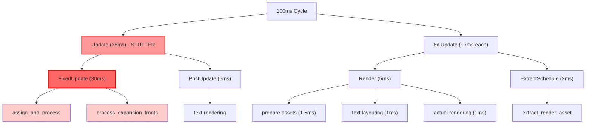

# Render Pipeline Documentation

## Current Pipeline Breakdown

The game runs on a dual-schedule system with a 10Hz logic rate (100ms per tick) and targets 100fps rendering.

### Frame Timeline (100ms cycle)

```
- update (35ms) ← STUTTER
  - fixed update (30ms)
    - assign_and_process
    - process_expansion_fronts
  - post update (5ms text rendering)
- update (8 in a row, ~7ms each)
  - render (5ms)
    - prepare assets (GpuImage) (1.5ms)
    - text layouting (1ms)
    - actual rendering (1ms)
  - ExtractSchedule
    - extract_render_asset (2ms)
```

#### Timeline Visualization

```mermaid
gantt
    title Frame Timeline (100ms cycle showing 35ms stutter)
    dateFormat X
    axisFormat %L ms

    section Update (35ms STUTTER)
    FixedUpdate (30ms)     :crit, fix, 0, 30
    PostUpdate (5ms)       :done, post, 30, 35

    section Smooth Frames (56ms)
    Frame 1 Render         :active, r1, 35, 40
    Frame 1 Extract        :r1e, 40, 42
    Frame 2 Render         :active, r2, 42, 47
    Frame 2 Extract        :r2e, 47, 49
    Frame 3 Render         :active, r3, 49, 54
    Frame 3 Extract        :r3e, 54, 56
    Frame 4 Render         :active, r4, 56, 61
    Frame 4 Extract        :r4e, 61, 63
    Frame 5 Render         :active, r5, 63, 68
    Frame 5 Extract        :r5e, 68, 70
    Frame 6 Render         :active, r6, 70, 75
    Frame 6 Extract        :r6e, 75, 77
    Frame 7 Render         :active, r7, 77, 82
    Frame 7 Extract        :r7e, 82, 84
    Frame 8 Render         :active, r8, 84, 89
    Frame 8 Extract        :r8e, 89, 91
```



#### Hierarchical Breakdown



### Performance Characteristics

- **GPU Utilization**: ~1ms of actual rendering per frame
- **CPU Bottleneck**: 30ms in FixedUpdate every 100ms
- **Result**: 30ms "stop-the-world" stutter every 100ms where the renderer is starved

## The Problem: Frame Stutter

### What Happens

Every 100ms, the rendering pipeline experiences a 30ms gap where no frames are rendered:

1. **Frames 1-8** (80ms): Smooth rendering at high FPS
2. **FixedUpdate hits** (30ms): Main scheduler blocked
   - `update_game` runs for 30ms
   - No Update schedule execution
   - No rendering during this period
3. **Resume**: Rendering continues for next 8 frames

### Why This Happens

#### Bevy's Scheduler Architecture

Bevy does NOT run schedules on completely independent threads. Instead:

1. **Main Orchestrator Thread**: Coordinates the entire game loop
2. **Sequential Schedule Execution**: Schedules run in order with synchronization points
3. **Thread Pool (rayon)**: Systems within a schedule can run in parallel on the worker pool

**Critical Detail**: The scheduler will not start executing the `Update` schedule until all systems in `FixedUpdate` have finished.

#### The Execution Flow

```
Main Thread (Orchestrator)
├─> PreUpdate (dispatch to thread pool) → wait for completion
├─> FixedUpdate (every 100ms)
│   ├─> Dispatch update_game to thread pool
│   └─> BLOCK for 30ms waiting for completion ← THE PROBLEM
├─> Update (rendering prep)
│   └─> Finally dispatched after FixedUpdate completes
└─> Render
```

Even though systems CAN use multiple threads via the pool, the **synchronization point** between FixedUpdate and Update creates a hard 30ms gap.

### User Impact

- **Perceptible Jank**: Smooth 100fps interrupted by a harsh stutter every 1/10th second
- **Unresponsive Input**: Input processing blocked during the 30ms window
- **Poor Frame Pacing**: Average FPS high, but frame time variance terrible
- **No Headroom**: 30ms/100ms = 30% of budget used with only 70ms buffer before simulation falls behind

## The Solution: GPU Compute Offload

### Goal

Transform the 30ms CPU bottleneck into a 1-2ms GPU task, eliminating the stutter.

### Architecture

#### Current (CPU-bound)
```
Board (Res<Vec<TileData>>)
  ↓
update_game() - 30ms on CPU thread pool
  - Iterate all tiles
  - Check neighbors
  - Calculate conquests
  - Update board
  ↓
Rendering reads Board data
```

#### Proposed (GPU-bound)
```
GpuBoard (ping-pong textures)
  ↓
prepare_gpu_dispatch() - <1ms on CPU
  - Gather active fronts
  - Upload to GPU buffer
  ↓
GPU Compute Shader - 1-2ms on GPU
  - Parallel per-tile processing
  - Atomic operations for conquest limits
  - Write to output texture
  ↓
Flip textures (read ↔ write)
  ↓
Rendering uses GPU texture directly
```

### Key Components

#### 1. GpuBoard Resource

Replaces `Res<Board>` with GPU-resident state.

```rust
#[derive(Resource)]
pub struct GpuBoard {
    pub board_textures: [Handle<Image>; 2],  // Ping-pong buffers
    frame_count: usize,
}

impl GpuBoard {
    pub fn read(&self) -> &Handle<Image> {
        &self.board_textures[self.frame_count % 2]
    }

    pub fn write(&self) -> &Handle<Image> {
        &self.board_textures[(self.frame_count + 1) % 2]
    }

    pub fn flip(&mut self) {
        self.frame_count += 1;
    }
}
```

**Texture Format**: `R16Uint` with `STORAGE_BINDING | TEXTURE_BINDING` usage

#### 2. Compute Shader Data Structures

```rust
#[derive(ShaderType, Clone, Copy)]
struct Front {
    attacker_id: u32,
    defender_id: u32,
    tiles_to_conquer: u32,
    _padding: u32,  // WGSL alignment (std140)
}
```

#### 3. GPU Resources

**Bind Group Layout**:
- Binding 0: `storage buffer` - Active fronts array
- Binding 1: `storage buffer` - Atomic conquest counters
- Binding 2: `texture_2d<u32>` - Read board (current state)
- Binding 3: `texture_storage_2d` - Write board (next state)

### Implementation Plan

#### Phase 1: Infrastructure Setup

1. **Create GpuBoard resource**
   - Two R16Uint textures with STORAGE_BINDING
   - Setup system at Startup
   - Methods: read(), write(), flip()

2. **Create ComputePlugin**
   - Render graph integration OR use `bevy_wgsl_compute` crate
   - Pipeline setup
   - Bind group management

#### Phase 2: Port Logic to GPU

3. **CPU Orchestrator System**

```rust
fn prepare_gpu_dispatch(
    expansions: Res<ActiveExpansions>,
    mut gpu_buffers: ResMut<GpuBuffers>,
    mut storage_buffers: ResMut<Assets<ShaderStorageBuffer>>,
) {
    // Collect active fronts from ActiveExpansions
    let mut active_fronts: Vec<Front> = Vec::new();

    for a in 0..NUM_ENTITIES {
        for b in (a + 1)..NUM_ENTITIES {
            let net_troops = expansions.get_net_troops(a, b);
            if net_troops == 0 { continue; }

            let (attacker, defender) = if net_troops > 0 {
                (a, b)
            } else {
                (b, a)
            };

            let velocity = net_troops.abs();
            let tiles_to_conquer = (velocity as f32 * EXPANSION_RATE_BASE / 100.0)
                .max(0.1) as u32;

            if tiles_to_conquer > 0 {
                active_fronts.push(Front {
                    attacker_id: attacker as u32,
                    defender_id: defender as u32,
                    tiles_to_conquer,
                    _padding: 0,
                });
            }
        }
    }

    // Upload to GPU buffer (fast operation)
    update_storage_buffer(&mut storage_buffers, &gpu_buffers.fronts_buffer, &active_fronts);
}
```

4. **Compute Shader (expansion.wgsl)**

```wgsl
struct Front {
    attacker_id: u32,
    defender_id: u32,
    tiles_to_conquer: u32,
};

@group(0) @binding(0) var<storage, read> fronts: array<Front>;
@group(0) @binding(1) var<storage, read_write> conquer_counters: array<atomic<u32>>;
@group(0) @binding(2) var read_board: texture_2d<u32>;
@group(0) @binding(3) var write_board: texture_storage_2d<r16uint, write>;

const TILE_OWNER_MASK = 0x0FFFu;

fn is_conquerable(pos: vec2<i32>, front: Front) -> bool {
    let dims = textureDimensions(read_board);

    // Check 8 neighbors for attacker's presence
    for (var y: i32 = -1; y <= 1; y++) {
        for (var x: i32 = -1; x <= 1; x++) {
            if (x == 0 && y == 0) { continue; }

            let neighbor_pos = pos + vec2<i32>(x, y);

            if (neighbor_pos.x >= 0 && neighbor_pos.x < dims.x &&
                neighbor_pos.y >= 0 && neighbor_pos.y < dims.y) {

                let neighbor_owner = textureLoad(read_board, neighbor_pos, 0).x & TILE_OWNER_MASK;

                if (neighbor_owner == front.attacker_id) {
                    return true;
                }
            }
        }
    }
    return false;
}

@compute @workgroup_size(16, 16, 1)
fn main(@builtin(global_invocation_id) global_id: vec3<u32>) {
    let pos = vec2<i32>(global_id.xy);
    let dims = textureDimensions(read_board);

    if (pos.x >= dims.x || pos.y >= dims.y) { return; }

    let original_data = textureLoad(read_board, pos, 0).x;
    let owner_id = original_data & TILE_OWNER_MASK;
    var new_data = original_data;

    // Check each active front
    for (var i = 0u; i < arrayLength(&fronts); i++) {
        let front = fronts[i];

        // Is this tile a valid conquest target?
        if (owner_id == front.defender_id && is_conquerable(pos, front)) {
            // Atomically claim a conquest slot
            let count = atomicAdd(&conquer_counters[i], 1u);

            if (count < front.tiles_to_conquer) {
                // Successfully claimed - update owner
                new_data = (original_data & ~TILE_OWNER_MASK) | front.attacker_id;
            }
            break;  // One conquest per tile per tick
        }
    }

    textureStore(write_board, global_id.xy, vec4<u32>(new_data, 0, 0, 0));
}
```

5. **Dispatch System**

```rust
fn gpu_dispatch_system(
    gpu_board: ResMut<GpuBoard>,
    // Pipeline, bind groups, command encoder, etc.
) {
    // 1. Bind resources
    // 2. Dispatch compute shader
    //    - Workgroups = ceil(board_width / 16) x ceil(board_height / 16)
    // 3. Flip ping-pong textures
    gpu_board.flip();
}
```

#### Phase 3: Integration

6. **Update FixedUpdate schedule**

```rust
app.add_systems(FixedUpdate,
    prepare_gpu_dispatch
        .before(gpu_dispatch_system)
);
app.add_systems(FixedUpdate, gpu_dispatch_system);
```

7. **Adapt dependent systems**
   - Update systems that read board state to use GPU textures
   - Consider GPU-side reductions for statistics/analysis

### Expected Performance

#### Before
```
FixedUpdate: 30ms (CPU)
├─ assign_and_process: ~5ms
└─ process_expansion_fronts: ~25ms ← bottleneck

Frame time variance: 5-35ms (terrible frame pacing)
```

#### After
```
FixedUpdate: <2ms (CPU → GPU)
├─ prepare_gpu_dispatch: <1ms (CPU)
└─ gpu_dispatch_system: <1ms (GPU kickoff)
    └─ GPU execution: 1-2ms (parallel, non-blocking)

Frame time variance: 5-7ms (smooth, consistent)
```

### Benefits

1. **Eliminates Stutter**: 30ms → 1-2ms = ~95% reduction
2. **Consistent Frame Pacing**: Smooth 100fps without hitches
3. **Responsive Input**: No 30ms blocked windows
4. **Headroom**: 98ms/100ms buffer for future complexity
5. **Scalability**: GPU parallelism scales with board size better than CPU iteration

### Technical Considerations

#### Ping-Pong Buffers

**Why?** GPU can't safely read and write the same texture simultaneously.

**Pattern**:
- Frame N: Read from texture A, write to texture B
- Frame N+1: Read from texture B, write to texture A

#### Atomic Operations

**Purpose**: Ensure `tiles_to_conquer` limit is respected across parallel threads.

**Mechanism**: Each front has an atomic counter. Threads atomically increment and check if they claimed a valid slot.

#### Memory Coherency

**Challenge**: GPU writes must be visible to next frame's read.

**Solution**: Proper barriers/fences in the dispatch system (handled by Bevy's render graph).

### Future Optimizations

1. **GPU-side AI**: Move assign_and_process to compute shader
2. **Reduction Shaders**: Calculate statistics (territory counts, etc.) on GPU
3. **Async Compute**: Run compute shaders on dedicated queue for even better parallelism
4. **Persistent Threads**: Use more advanced GPU patterns for complex logic

## Debugging Guide

### Profiling Points

1. **CPU Orchestrator**: Use `tracing` spans around prepare_gpu_dispatch
2. **GPU Timing**: Use `wgpu::QuerySet` for precise GPU timings
3. **Frame Pacing**: Monitor frame time histogram, look for variance

### Common Issues

**Synchronization Errors**: Ensure proper flip() call after dispatch

**Atomic Overflow**: Verify counter buffer is cleared each frame

**Border Artifacts**: Check is_conquerable() boundary conditions

**Performance Regression**: Confirm textures have STORAGE_BINDING usage flag

## References

- [Bevy Compute Shader Guide](https://bevyengine.org/examples/Shaders/compute-shader-game-of-life/)
- [bevy_wgsl_compute crate](https://github.com/Kjolnyr/bevy_wgsl_compute)
- [WGSL Specification](https://www.w3.org/TR/WGSL/)
- [GPU Gems: Parallel Computing](https://developer.nvidia.com/gpugems/gpugems3/part-vi-gpu-computing)
